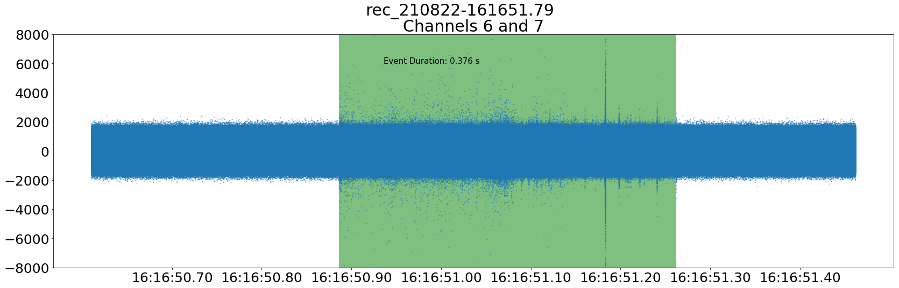

# QFH antenna array

The array of antennas is mounted on CRREAT car roof in square configuration.

## Detected signals

The signal envelope recorded from each antenna typically  looks like this example:

