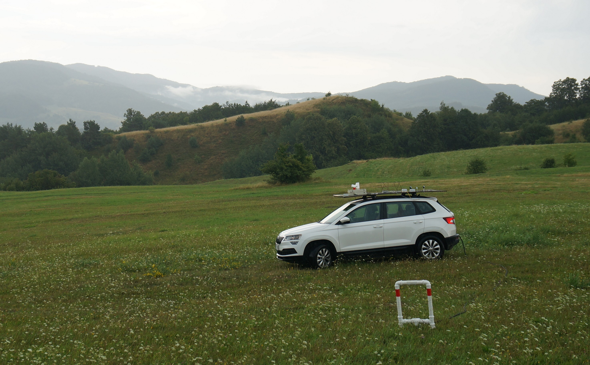

# CRREAT measuring cars repository

Scripts for parsing data from measurement devices mounted on cars for thunderstorm chasing.

## Equipment of the cars

### CAR 0

  * Radio Storm Monitoring system  (four antennas)
  * Mobile Blitzortung Station for triggering
  * [Anemometer](https://github.com/mlab-modules/WINDGAUGE03)
  * [Distrometer](https://github.com/UniversalScientificTechnologies/DISTROMETER01)
  * GNSS position and orientation tracking
  * [High-speed camera](https://www.krontech.ca/store/Chronos-1-4-High-Speed-Camera-p92268927)

### CAR 1

  * [Anemometer](https://github.com/mlab-modules/WINDGAUGE03)
  * Distrometer
  * GNSS position and orientation tracking
  * High-speed camera
  * Gamma spectrometer

### CAR 2

  * [Anemometer](https://github.com/mlab-modules/WINDGAUGE03)
  * Mobile Magnetic loop antenna
  * Distrometer
  * GNSS position and orientation tracking
  * Gamma spectrometer
