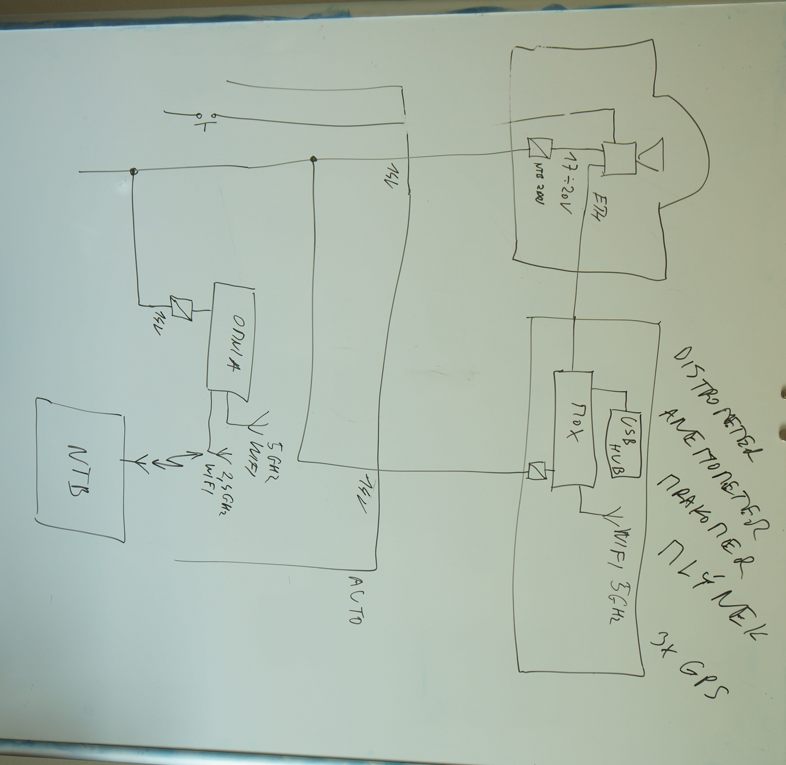
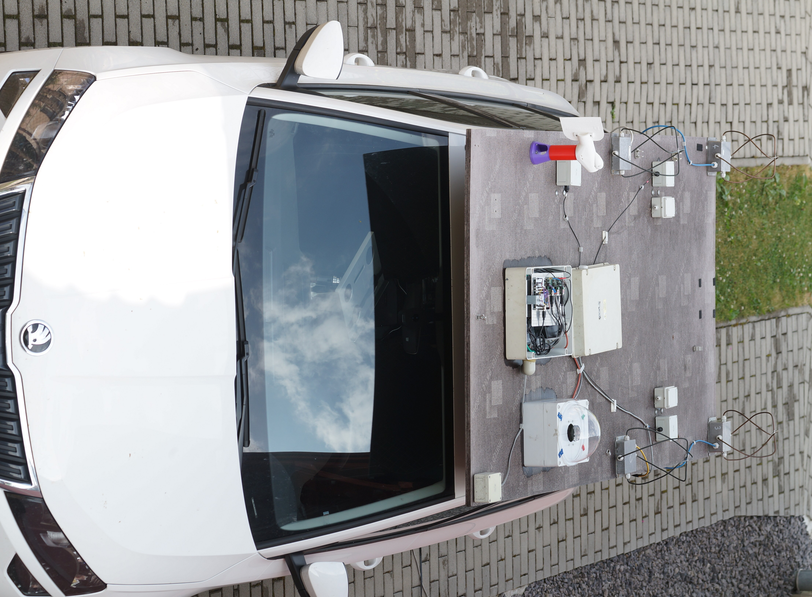
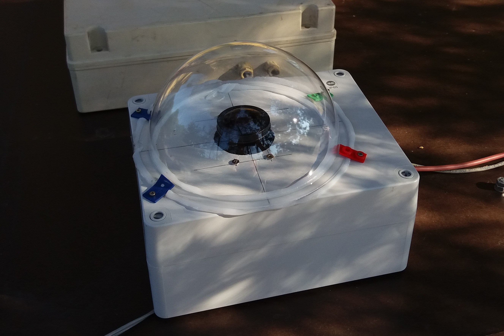

# CRREAT measuring cars repository

Scripts for parsing data from measurement devices mounted on cars for thunderstorm chasing.

## Measuring cars configurations

### CAR 0

  * Radio Storm Monitoring system  (four antennas)
  * Mobile Blitzortung Station for triggering
  * [Anemometer](https://github.com/mlab-modules/WINDGAUGE03)
  * [Distrometer](https://github.com/UniversalScientificTechnologies/DISTROMETER01)
  * [GNSS position and orientation tracking](https://github.com/ODZ-UJF-AV-CR/CRREAT_cars/tree/master/position_tracking)
  * [High-speed camera](https://github.com/ODZ-UJF-AV-CR/CRREAT_cars/tree/master/chronos_camera)

### CAR 1

CRREAT car 1 is documented in the [own repository](https://github.com/ODZ-UJF-AV-CR/auto1)

  * [Anemometer](https://github.com/mlab-modules/WINDGAUGE03)
  * [Distrometer](https://github.com/UniversalScientificTechnologies/DISTROMETER01)
  * [GNSS position and orientation tracking](https://github.com/ODZ-UJF-AV-CR/CRREAT_cars/tree/master/position_tracking)
  * [High-speed camera](https://github.com/ODZ-UJF-AV-CR/CRREAT_cars/tree/master/chronos_camera)
  * Slavia detector with oscilloscope
  * [Mobile Magnetic loop antenna](https://github.com/ODZ-UJF-AV-CR/CRREAT_cars/tree/master/magnetic_loop)

### CAR 2

  * [Anemometer](https://github.com/mlab-modules/WINDGAUGE03)
  * [Mobile Magnetic loop antenna](https://github.com/ODZ-UJF-AV-CR/CRREAT_cars/tree/master/magnetic_loop)
  * [Distrometer](https://github.com/UniversalScientificTechnologies/DISTROMETER01)
  * [GNSS position and orientation tracking](https://github.com/ODZ-UJF-AV-CR/CRREAT_cars/tree/master/position_tracking)
  * Gamma spectrometer
