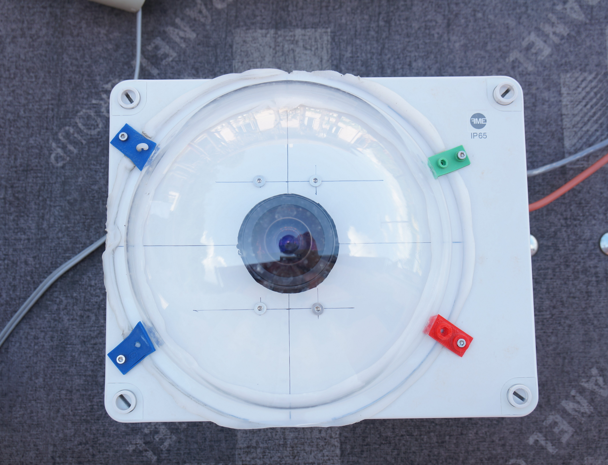
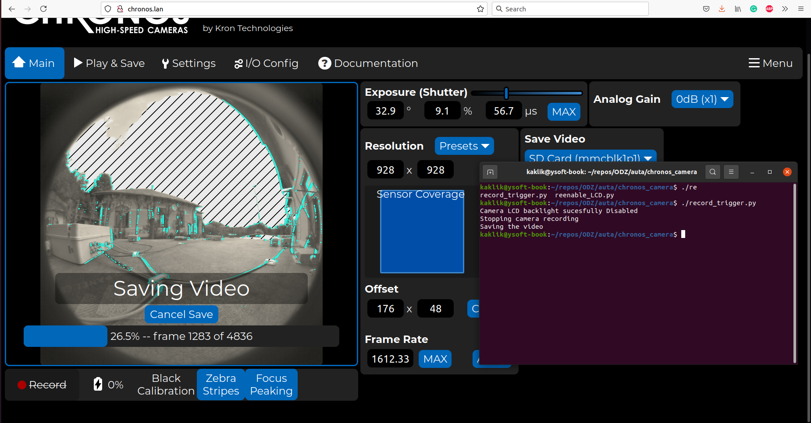

# Lightning video capture system  

The system expect the Chronos high-speed camera mounted on car roof. The camera should be connected to 1Gigabit Ethernet and powered from stable power source.
The Recording mode should be activated manually from the camera web GUI.

## Example videos

### Daytime thunderstorm

### Nigth thunderstorm 

## Installation

### Software

    sudo apt-get install python-requests

### Hardware

[Chronos 1.4 camera CR14-1.0-16M](https://www.krontech.ca/product/chronos-1-4-high-speed-camera) is mounted in waterproof [SolidBox 69200](https://www.elima.cz/obchod/68200-krabice-solidbox-ip65-270x220x126mm-plne-viko-hladke-boky-famatel-p-34205.html). The box is covered by plexiglass dome [Duradom 200mm](https://www.amazon.com/CATLAB-Acrylic-Flange-Plastic-Hemisphere/dp/B07DNVWRHP)

Camera itself has wide angle CS [FE185C057HA-1](https://www.bhphotovideo.com/c/product/404281-REG/Fujinon_FE185C057HA1_FE185C057HA_1_2_3_1_8mm_F_1_4.html) lenses. Power of the camera is delivered from 12V car on-board socket. The camera requires 20V as power input. Therefore the power voltage is converted by [power supply converter](https://www.alza.cz/EN/auto/oem-power-supply-converter-for-laptops-12-30v-90w-d6269710.htm)

## Usage

The camera should be in "Recording" state. Then a call of the script causes a save of the video Recorded in  RAM.

    ./record_trigger.py

This script disable camera LCD to save power and then save the recorded video from RAM.

I the case the LCD needs to be activated again. It could be done by different script

    ./reenable_LCD.py
