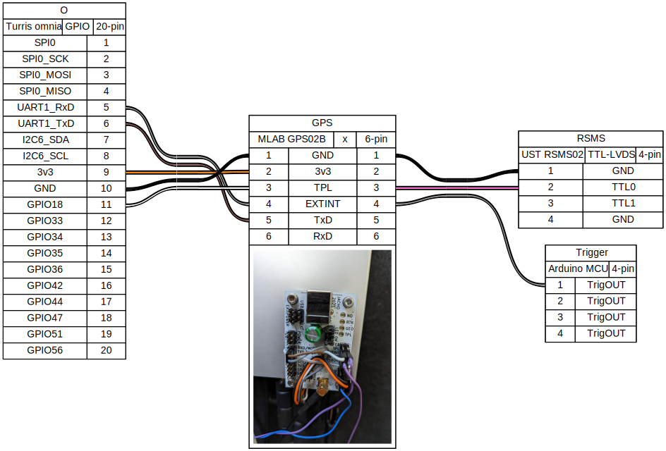

## General documentation of CAR's connections 

## Main power input 

Power input source is [ISO 11446 connector](https://en.wikipedia.org/wiki/ISO_11446)

schematics created by [WireViz](https://github.com/formatc1702/WireViz).

## Connection of GPS (and PPS signal) to turris Omnia router

  
