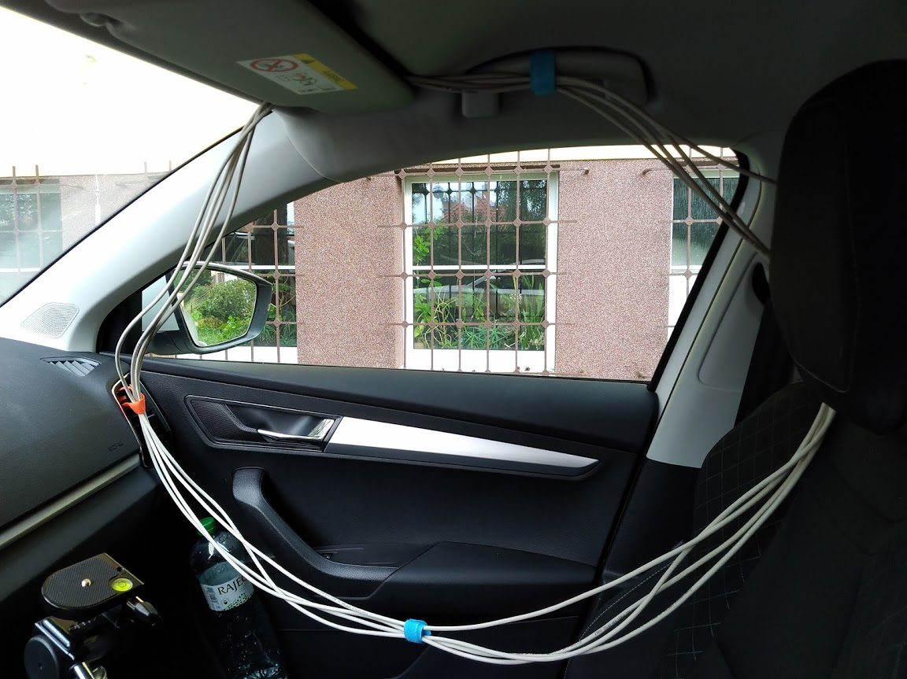
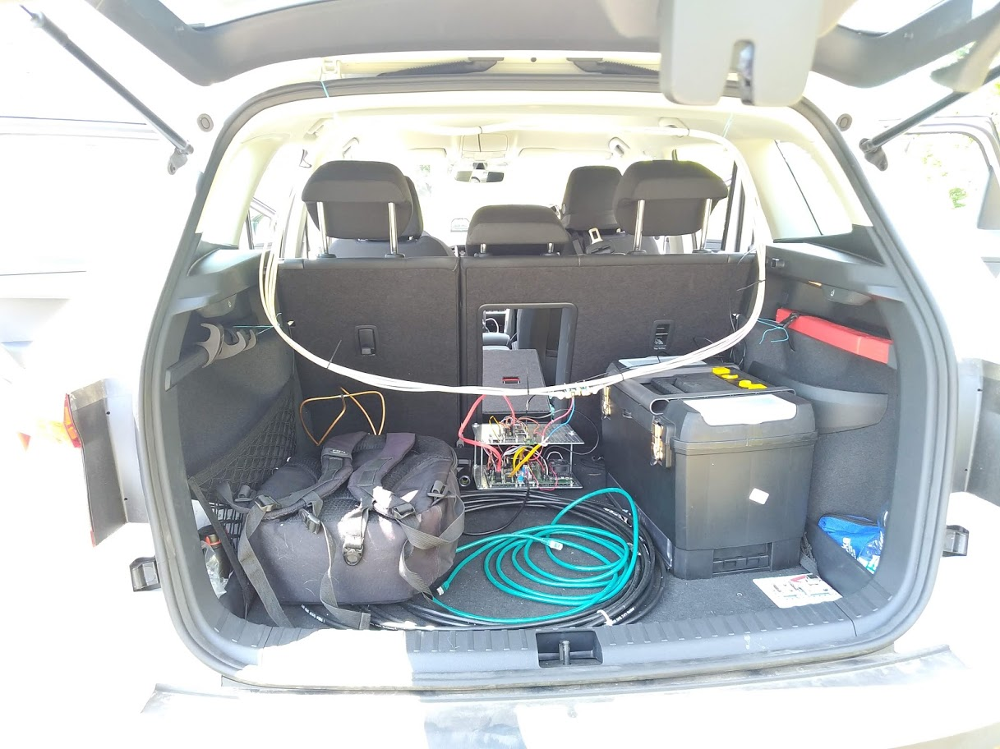
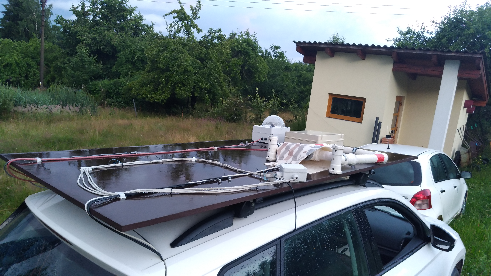

# Magnetic loop antenna

The magnetic loop antenna is one of on board triggering system, which is used to trigger recording of instruments.
The construction originates in [VLF monitoring station](https://github.com/Ionozor/VLFMON01). But the antenna has sufficient bandwidth (around 200kHz), to be used for lightning detection and possible localization.  

The antenna consist basically [VLFANT01A MLAB module](https://github.com/mlab-modules/VLFANT01) and 5 meters length STP patch cable. The number of turns is not critical, but decreasing the area of loop decreases sensitivity.   

## Installation

The antenna is mounted on board the car by multiple ways.

In every case the antenna is directly connected to a oscilloscope input. The oscilloscope triggers from signal amplitude and pulse width.
